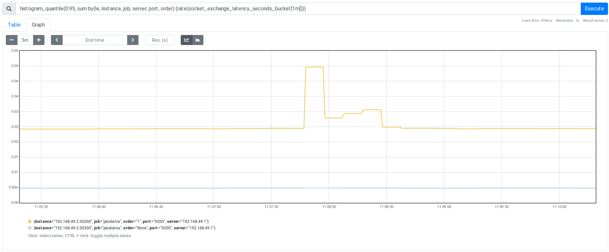

Prometheus metrics
==================

Latency
-------

the 95th percentile of requests sent to member servers latency in seconds

the 95th percentile of the time (in seconds) for a single data exchange on the socket with a server.
The `order` label is `None` for the head of the request and `1` for the first payload packet;
if the head is sent with the data payload, we start at `0`;
this way a packet with `order` label at `1` is the first one being sent without `head` data

Errors
------

ratio of errors over the total number of requests

number of errors per second

Requests per second
-------------------

number of requests per second send to member servers

number of requests per second received from clients

Sample dashboard
----------------

Here is an [example of a prometheus dashboard page](http://localhost:9090/graph?g0.expr=histogram_quantile(0.95%2C%20sum%20by(le%2C%20instance%2C%20job%2C%20port%2C%20server)%20(rate(request_processing_seconds_bucket%5B1m%5D)))%20&g0.tab=0&g0.stacked=0&g0.range_input=15m&g1.expr=rate(status_total%7Berror!%3D%22None%22%7D%5B1m%5D)%20%2F%20ignoring(error)%20group_left()%20sum%20without(error)%20(rate(status_total%5B1m%5D))%20&g1.tab=0&g1.stacked=0&g1.range_input=15m&g2.expr=histogram_quantile(0.95%2C%20sum%20by(le%2C%20instance%2C%20job%2C%20server%2C%20port%2C%20order)%20(rate(socket_exchange_latency_seconds_bucket%5B1m%5D)))&g2.tab=0&g2.stacked=0&g2.range_input=15m&g3.expr=rate(request_processing_seconds_count%5B1m%5D)&g3.tab=0&g3.stacked=0&g3.range_input=15m&g4.expr=rate(status_total%7Berror!%3D%22None%22%7D%5B1m%5D)&g4.tab=0&g4.stacked=0&g4.range_input=15m&g5.expr=sum%20without(error)%20(rate(status_total%5B1m%5D))%20&g5.tab=0&g5.stacked=0&g5.range_input=15m)
providing that prometheus is listening on http://localhost:9090.

