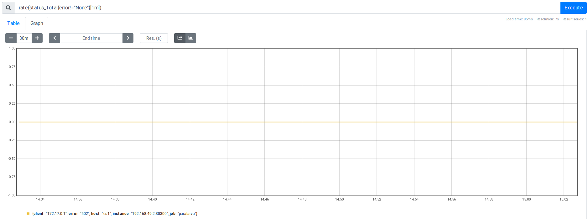
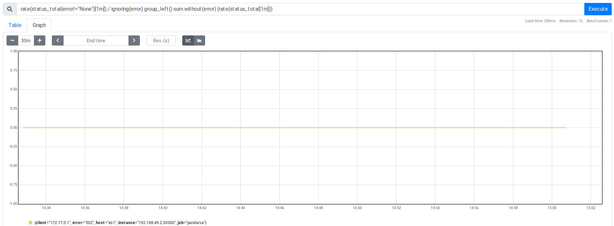
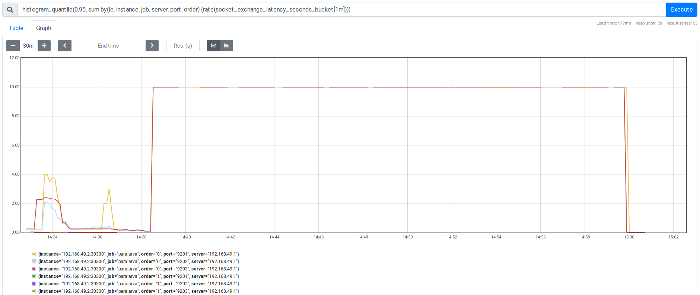
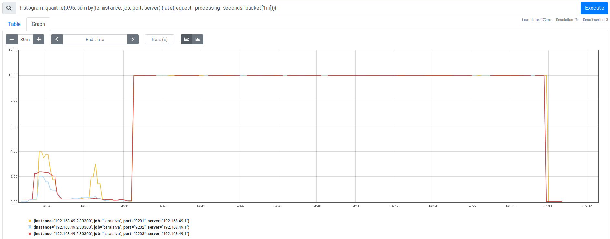
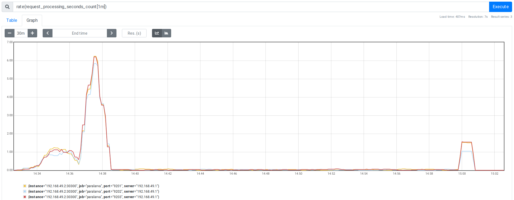
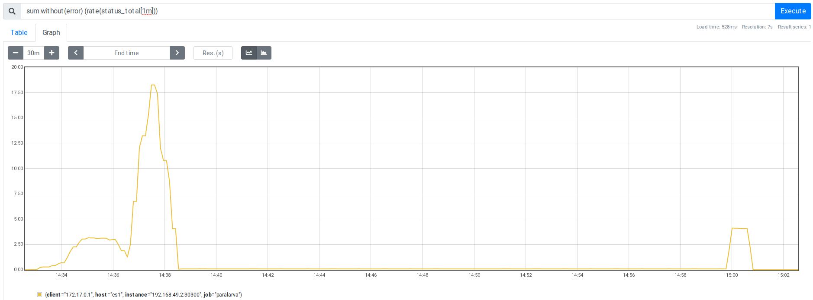

es-rally docker test using paralarva
====================================

Prerequisite
-----------
Adding and entry in local user hosts file
```
$ echo "es1 $(minikube ip)" | tee -a ~/.hosts
192.168.49.2
$ export HOSTALIASES=~/.hosts
```

Making sure it works
```
$ curl es1:30303
{
  "name" : "es1n3",
  "cluster_name" : "es1",
  "cluster_uuid" : "DuHrbCsNR0uFR7gQphhzsA",
  "version" : {
    "number" : "7.11.0",
    "build_flavor" : "default",
    "build_type" : "docker",
    "build_hash" : "8ced7813d6f16d2ef30792e2fcde3e755795ee04",
    "build_date" : "2021-02-08T22:44:01.320463Z",
    "build_snapshot" : false,
    "lucene_version" : "8.7.0",
    "minimum_wire_compatibility_version" : "6.8.0",
    "minimum_index_compatibility_version" : "6.0.0-beta1"
  },
  "tagline" : "You Know, for Search"
}
```

Actual test result
------------------
The main information these results provide at this point is that no errors were measured by the benchmarking tool.
To have more information we need to compare these results with a baseline bypassing our proxy.
```
$ esrally race --track=percolator --target-hosts=es1:30303 --pipeline=benchmark-only --user-tag="es1:30303"


    ____        ____
   / __ \____ _/ / /_  __
  / /_/ / __ `/ / / / / /
 / _, _/ /_/ / / / /_/ /
/_/ |_|\__,_/_/_/\__, /
                /____/

[INFO] Racing on track [percolator], challenge [append-no-conflicts] and car ['external'] with version [7.11.0].

Running delete-index                                                           [100% done]
Running create-index                                                           [100% done]
Running check-cluster-health                                                   [100% done]
Running index                                                                  [100% done]
Running refresh-after-index                                                    [100% done]
Running force-merge                                                            [100% done]
Running refresh-after-force-merge                                              [100% done]
Running wait-until-merges-finish                                               [100% done]
Running percolator_with_content_president_bush                                 [100% done]
Running percolator_with_content_saddam_hussein                                 [100% done]
Running percolator_with_content_hurricane_katrina                              [100% done]
Running percolator_with_content_google                                         [100% done]
Running percolator_no_score_with_content_google                                [100% done]
Running percolator_with_highlighting                                           [100% done]
Running percolator_with_content_ignore_me                                      [100% done]
Running percolator_no_score_with_content_ignore_me                             [100% done]

------------------------------------------------------
    _______             __   _____
   / ____(_)___  ____ _/ /  / ___/_________  ________
  / /_  / / __ \/ __ `/ /   \__ \/ ___/ __ \/ ___/ _ \
 / __/ / / / / / /_/ / /   ___/ / /__/ /_/ / /  /  __/
/_/   /_/_/ /_/\__,_/_/   /____/\___/\____/_/   \___/
------------------------------------------------------
            
|                                                         Metric |                                       Task |       Value |   Unit |
|---------------------------------------------------------------:|-------------------------------------------:|------------:|-------:|
|                     Cumulative indexing time of primary shards |                                            |     2.79437 |    min |
|             Min cumulative indexing time across primary shards |                                            |    0.547083 |    min |
|          Median cumulative indexing time across primary shards |                                            |    0.551617 |    min |
|             Max cumulative indexing time across primary shards |                                            |    0.594817 |    min |
|            Cumulative indexing throttle time of primary shards |                                            |           0 |    min |
|    Min cumulative indexing throttle time across primary shards |                                            |           0 |    min |
| Median cumulative indexing throttle time across primary shards |                                            |           0 |    min |
|    Max cumulative indexing throttle time across primary shards |                                            |           0 |    min |
|                        Cumulative merge time of primary shards |                                            |     0.05015 |    min |
|                       Cumulative merge count of primary shards |                                            |           5 |        |
|                Min cumulative merge time across primary shards |                                            |  0.00871667 |    min |
|             Median cumulative merge time across primary shards |                                            |     0.00995 |    min |
|                Max cumulative merge time across primary shards |                                            |   0.0114333 |    min |
|               Cumulative merge throttle time of primary shards |                                            |           0 |    min |
|       Min cumulative merge throttle time across primary shards |                                            |           0 |    min |
|    Median cumulative merge throttle time across primary shards |                                            |           0 |    min |
|       Max cumulative merge throttle time across primary shards |                                            |           0 |    min |
|                      Cumulative refresh time of primary shards |                                            |      0.5649 |    min |
|                     Cumulative refresh count of primary shards |                                            |         101 |        |
|              Min cumulative refresh time across primary shards |                                            |   0.0856667 |    min |
|           Median cumulative refresh time across primary shards |                                            |    0.112683 |    min |
|              Max cumulative refresh time across primary shards |                                            |    0.132533 |    min |
|                        Cumulative flush time of primary shards |                                            |           0 |    min |
|                       Cumulative flush count of primary shards |                                            |           5 |        |
|                Min cumulative flush time across primary shards |                                            |           0 |    min |
|             Median cumulative flush time across primary shards |                                            |           0 |    min |
|                Max cumulative flush time across primary shards |                                            |           0 |    min |
|                                        Total Young Gen GC time |                                            |      53.113 |      s |
|                                       Total Young Gen GC count |                                            |        8049 |        |
|                                          Total Old Gen GC time |                                            |           0 |      s |
|                                         Total Old Gen GC count |                                            |           0 |        |
|                                                     Store size |                                            |   0.0391504 |     GB |
|                                                  Translog size |                                            | 2.56114e-07 |     GB |
|                                         Heap used for segments |                                            |   0.0514221 |     MB |
|                                       Heap used for doc values |                                            |  0.00646973 |     MB |
|                                            Heap used for terms |                                            |   0.0292969 |     MB |
|                                            Heap used for norms |                                            |           0 |     MB |
|                                           Heap used for points |                                            |           0 |     MB |
|                                    Heap used for stored fields |                                            |   0.0156555 |     MB |
|                                                  Segment count |                                            |          32 |        |
|                                                 Min Throughput |                                      index |     3169.05 | docs/s |
|                                                Mean Throughput |                                      index |     9967.71 | docs/s |
|                                              Median Throughput |                                      index |       11223 | docs/s |
|                                                 Max Throughput |                                      index |     12836.4 | docs/s |
|                                        50th percentile latency |                                      index |     2469.57 |     ms |
|                                        90th percentile latency |                                      index |     3950.55 |     ms |
|                                        99th percentile latency |                                      index |     8036.74 |     ms |
|                                       100th percentile latency |                                      index |     9679.19 |     ms |
|                                   50th percentile service time |                                      index |     2469.57 |     ms |
|                                   90th percentile service time |                                      index |     3950.55 |     ms |
|                                   99th percentile service time |                                      index |     8036.74 |     ms |
|                                  100th percentile service time |                                      index |     9679.19 |     ms |
|                                                     error rate |                                      index |           0 |      % |
|                                                 Min Throughput |     percolator_with_content_president_bush |       11.06 |  ops/s |
|                                                Mean Throughput |     percolator_with_content_president_bush |       12.41 |  ops/s |
|                                              Median Throughput |     percolator_with_content_president_bush |       12.44 |  ops/s |
|                                                 Max Throughput |     percolator_with_content_president_bush |       13.69 |  ops/s |
|                                        50th percentile latency |     percolator_with_content_president_bush |     9342.02 |     ms |
|                                        90th percentile latency |     percolator_with_content_president_bush |     10149.6 |     ms |
|                                        99th percentile latency |     percolator_with_content_president_bush |     10311.7 |     ms |
|                                       100th percentile latency |     percolator_with_content_president_bush |     10331.9 |     ms |
|                                   50th percentile service time |     percolator_with_content_president_bush |     39.6264 |     ms |
|                                   90th percentile service time |     percolator_with_content_president_bush |     56.7309 |     ms |
|                                   99th percentile service time |     percolator_with_content_president_bush |     74.3095 |     ms |
|                                  100th percentile service time |     percolator_with_content_president_bush |      101.89 |     ms |
|                                                     error rate |     percolator_with_content_president_bush |           0 |      % |
|                                                 Min Throughput |     percolator_with_content_saddam_hussein |       38.16 |  ops/s |
|                                                Mean Throughput |     percolator_with_content_saddam_hussein |       38.34 |  ops/s |
|                                              Median Throughput |     percolator_with_content_saddam_hussein |       38.34 |  ops/s |
|                                                 Max Throughput |     percolator_with_content_saddam_hussein |       38.53 |  ops/s |
|                                        50th percentile latency |     percolator_with_content_saddam_hussein |     947.083 |     ms |
|                                        90th percentile latency |     percolator_with_content_saddam_hussein |     973.839 |     ms |
|                                        99th percentile latency |     percolator_with_content_saddam_hussein |     996.816 |     ms |
|                                       100th percentile latency |     percolator_with_content_saddam_hussein |     1001.94 |     ms |
|                                   50th percentile service time |     percolator_with_content_saddam_hussein |     20.2954 |     ms |
|                                   90th percentile service time |     percolator_with_content_saddam_hussein |     31.6565 |     ms |
|                                   99th percentile service time |     percolator_with_content_saddam_hussein |      57.657 |     ms |
|                                  100th percentile service time |     percolator_with_content_saddam_hussein |     59.5644 |     ms |
|                                                     error rate |     percolator_with_content_saddam_hussein |           0 |      % |
|                                                 Min Throughput |  percolator_with_content_hurricane_katrina |       28.22 |  ops/s |
|                                                Mean Throughput |  percolator_with_content_hurricane_katrina |       29.79 |  ops/s |
|                                              Median Throughput |  percolator_with_content_hurricane_katrina |       30.23 |  ops/s |
|                                                 Max Throughput |  percolator_with_content_hurricane_katrina |       30.94 |  ops/s |
|                                        50th percentile latency |  percolator_with_content_hurricane_katrina |     1992.05 |     ms |
|                                        90th percentile latency |  percolator_with_content_hurricane_katrina |     2352.75 |     ms |
|                                        99th percentile latency |  percolator_with_content_hurricane_katrina |     2382.27 |     ms |
|                                       100th percentile latency |  percolator_with_content_hurricane_katrina |     2382.66 |     ms |
|                                   50th percentile service time |  percolator_with_content_hurricane_katrina |     24.1704 |     ms |
|                                   90th percentile service time |  percolator_with_content_hurricane_katrina |     37.2898 |     ms |
|                                   99th percentile service time |  percolator_with_content_hurricane_katrina |     44.4334 |     ms |
|                                  100th percentile service time |  percolator_with_content_hurricane_katrina |     45.4284 |     ms |
|                                                     error rate |  percolator_with_content_hurricane_katrina |           0 |      % |
|                                                 Min Throughput |             percolator_with_content_google |       10.03 |  ops/s |
|                                                Mean Throughput |             percolator_with_content_google |       10.25 |  ops/s |
|                                              Median Throughput |             percolator_with_content_google |       10.24 |  ops/s |
|                                                 Max Throughput |             percolator_with_content_google |        10.5 |  ops/s |
|                                        50th percentile latency |             percolator_with_content_google |     9205.49 |     ms |
|                                        90th percentile latency |             percolator_with_content_google |     11274.3 |     ms |
|                                        99th percentile latency |             percolator_with_content_google |     11627.6 |     ms |
|                                       100th percentile latency |             percolator_with_content_google |     11671.9 |     ms |
|                                   50th percentile service time |             percolator_with_content_google |     83.7204 |     ms |
|                                   90th percentile service time |             percolator_with_content_google |     116.153 |     ms |
|                                   99th percentile service time |             percolator_with_content_google |     178.762 |     ms |
|                                  100th percentile service time |             percolator_with_content_google |     187.749 |     ms |
|                                                     error rate |             percolator_with_content_google |           0 |      % |
|                                                 Min Throughput |    percolator_no_score_with_content_google |       38.59 |  ops/s |
|                                                Mean Throughput |    percolator_no_score_with_content_google |       39.78 |  ops/s |
|                                              Median Throughput |    percolator_no_score_with_content_google |       39.78 |  ops/s |
|                                                 Max Throughput |    percolator_no_score_with_content_google |       40.97 |  ops/s |
|                                        50th percentile latency |    percolator_no_score_with_content_google |     2261.62 |     ms |
|                                        90th percentile latency |    percolator_no_score_with_content_google |     2537.94 |     ms |
|                                        99th percentile latency |    percolator_no_score_with_content_google |     2604.64 |     ms |
|                                       100th percentile latency |    percolator_no_score_with_content_google |     2610.96 |     ms |
|                                   50th percentile service time |    percolator_no_score_with_content_google |     17.2653 |     ms |
|                                   90th percentile service time |    percolator_no_score_with_content_google |      26.002 |     ms |
|                                   99th percentile service time |    percolator_no_score_with_content_google |     38.5572 |     ms |
|                                  100th percentile service time |    percolator_no_score_with_content_google |     51.8766 |     ms |
|                                                     error rate |    percolator_no_score_with_content_google |           0 |      % |
|                                                 Min Throughput |               percolator_with_highlighting |       28.72 |  ops/s |
|                                                Mean Throughput |               percolator_with_highlighting |       30.18 |  ops/s |
|                                              Median Throughput |               percolator_with_highlighting |       30.31 |  ops/s |
|                                                 Max Throughput |               percolator_with_highlighting |        31.5 |  ops/s |
|                                        50th percentile latency |               percolator_with_highlighting |     1939.46 |     ms |
|                                        90th percentile latency |               percolator_with_highlighting |     2757.12 |     ms |
|                                        99th percentile latency |               percolator_with_highlighting |     2803.74 |     ms |
|                                       100th percentile latency |               percolator_with_highlighting |     2807.06 |     ms |
|                                   50th percentile service time |               percolator_with_highlighting |     28.1635 |     ms |
|                                   90th percentile service time |               percolator_with_highlighting |     50.6979 |     ms |
|                                   99th percentile service time |               percolator_with_highlighting |     124.665 |     ms |
|                                  100th percentile service time |               percolator_with_highlighting |     158.261 |     ms |
|                                                     error rate |               percolator_with_highlighting |           0 |      % |
|                                                 Min Throughput |          percolator_with_content_ignore_me |        0.08 |  ops/s |
|                                                Mean Throughput |          percolator_with_content_ignore_me |        0.08 |  ops/s |
|                                              Median Throughput |          percolator_with_content_ignore_me |        0.08 |  ops/s |
|                                                 Max Throughput |          percolator_with_content_ignore_me |        0.08 |  ops/s |
|                                        50th percentile latency |          percolator_with_content_ignore_me |     11287.3 |     ms |
|                                        90th percentile latency |          percolator_with_content_ignore_me |     13728.2 |     ms |
|                                        99th percentile latency |          percolator_with_content_ignore_me |     15490.3 |     ms |
|                                       100th percentile latency |          percolator_with_content_ignore_me |     15637.9 |     ms |
|                                   50th percentile service time |          percolator_with_content_ignore_me |     11260.1 |     ms |
|                                   90th percentile service time |          percolator_with_content_ignore_me |     11865.1 |     ms |
|                                   99th percentile service time |          percolator_with_content_ignore_me |     13198.5 |     ms |
|                                  100th percentile service time |          percolator_with_content_ignore_me |     13202.3 |     ms |
|                                                     error rate |          percolator_with_content_ignore_me |           0 |      % |
|                                                 Min Throughput | percolator_no_score_with_content_ignore_me |       15.06 |  ops/s |
|                                                Mean Throughput | percolator_no_score_with_content_ignore_me |       15.09 |  ops/s |
|                                              Median Throughput | percolator_no_score_with_content_ignore_me |       15.08 |  ops/s |
|                                                 Max Throughput | percolator_no_score_with_content_ignore_me |       15.12 |  ops/s |
|                                        50th percentile latency | percolator_no_score_with_content_ignore_me |     10.9528 |     ms |
|                                        90th percentile latency | percolator_no_score_with_content_ignore_me |     15.0499 |     ms |
|                                        99th percentile latency | percolator_no_score_with_content_ignore_me |      21.526 |     ms |
|                                       100th percentile latency | percolator_no_score_with_content_ignore_me |      24.201 |     ms |
|                                   50th percentile service time | percolator_no_score_with_content_ignore_me |     9.97566 |     ms |
|                                   90th percentile service time | percolator_no_score_with_content_ignore_me |     13.8994 |     ms |
|                                   99th percentile service time | percolator_no_score_with_content_ignore_me |     20.6697 |     ms |
|                                  100th percentile service time | percolator_no_score_with_content_ignore_me |     23.2845 |     ms |
|                                                     error rate | percolator_no_score_with_content_ignore_me |           0 |      % |


----------------------------------
[INFO] SUCCESS (took 1623 seconds)
----------------------------------
```


Metrics recorded
----------------

No errors were recorded during the benchmark

percentage of errors over total number of requests:


number of errors:


Responses from the server seem correctly handled. During the second part of test, the latency plateaued at 10 seconds;
this is not due to timeouts, but because of the way elasticsearch servers handle responses (as evidenced by the fact
that no error is detected neither by the proxy not the benchmarking tool). 

socket exchange latency (95th percentile):


Requests latencies pattern matches of the socket exchanges latencies.

server requests latency (95th percentile):


The number of requests per second measured on the server side shows that 
- at the beginning of the test there was a lot of requests that were served fast (see above remarks about latency), and
- during the second part there were fewer requests (but servers took up to 10 seconds to reply).

server side requests per second:


The client side requests per second matches the pattern from the server side with 3 times more requests, that
corresponds to the sum of the requests above-mentioned for the 3 elasticsearch containers.

client side requests per second:

